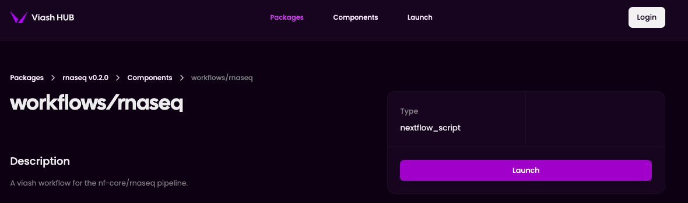
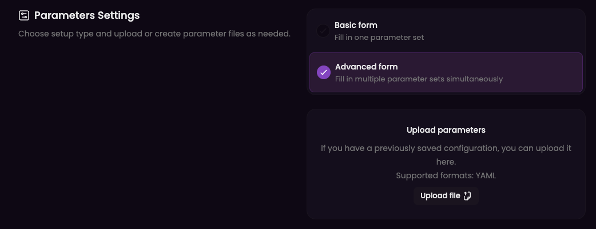
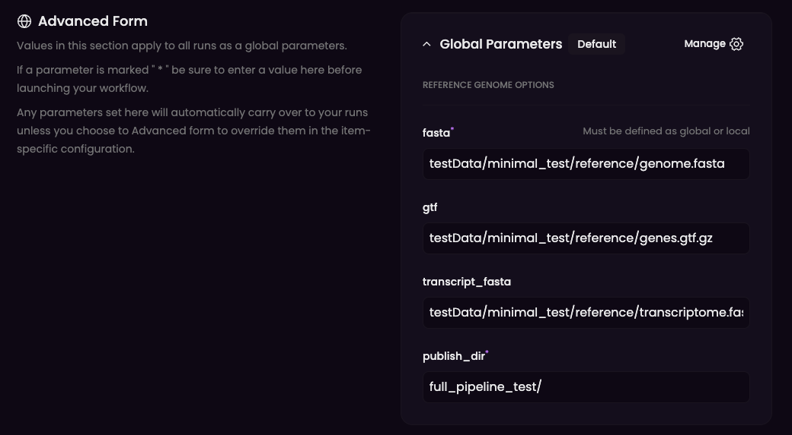
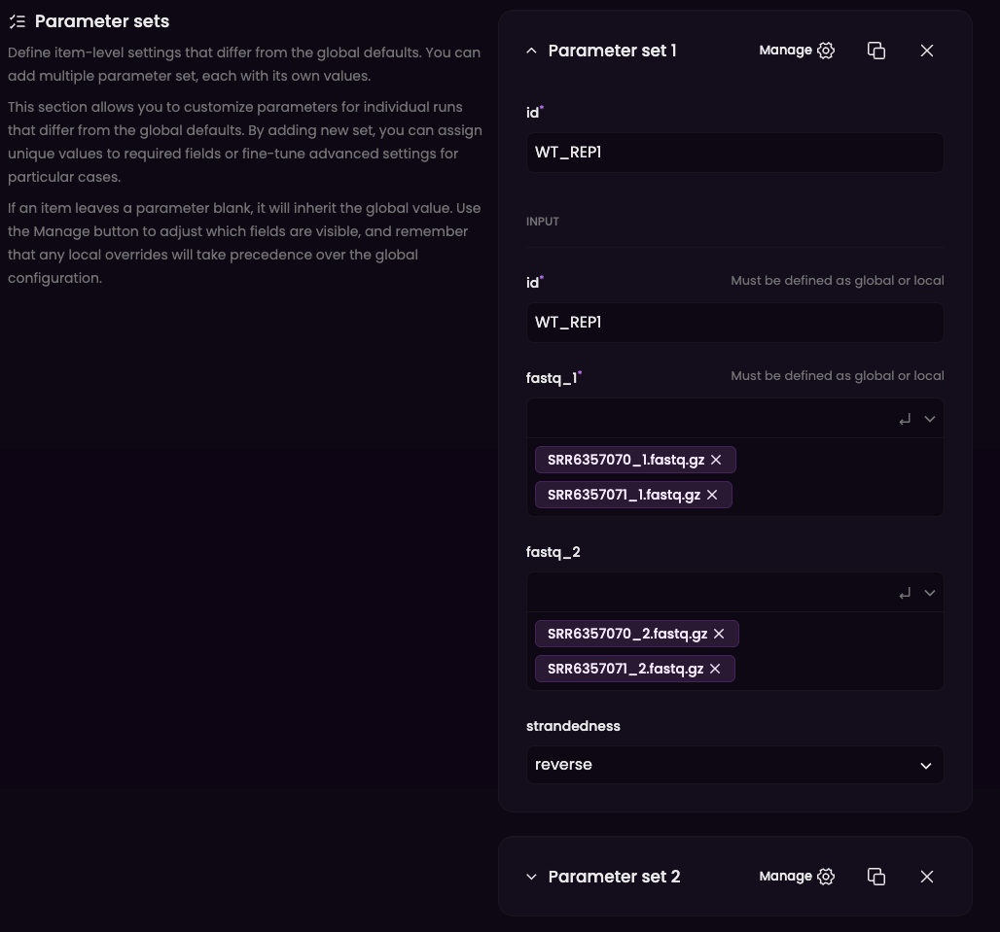
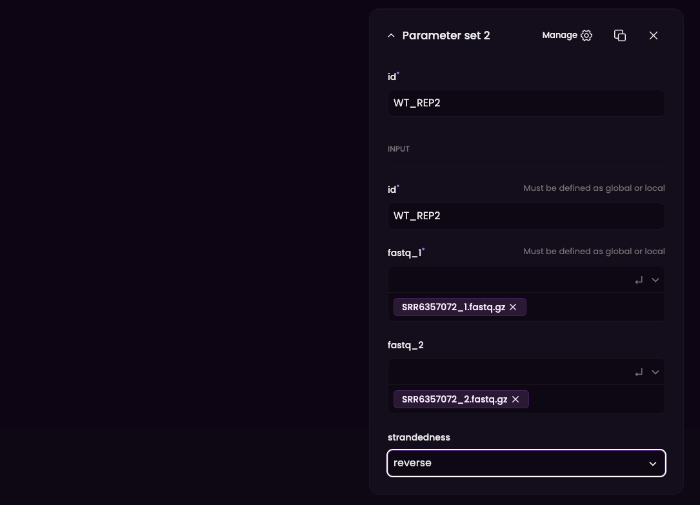
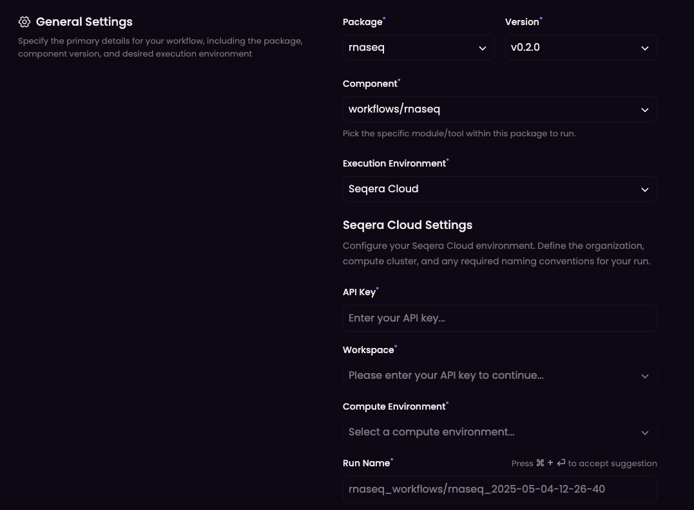

# RNAseq.vsh


<!-- README.md is generated by running 'quarto render README.qmd' -->

The RNAseq.vsh workflows is designed for end-to-end processing of bulk
RNA-seq data.

## Introduction

This package contains the
[nf-core/rnaseq](https://github.com/nf-core/rnaseq) pipeline (version
3.14.0) in the [Viash framework](http://www.viash.io). We stick to the
nf-core pipeline as much as possible. This also means that we create a
subworkflow for the main stages of the pipeline as depicted in the
[nf-core README](https://github.com/nf-core/rnaseq).

### Modular design

The workflow is built in a modular fashion, where most of the base
functionality is provided by components from
[biobox](https://www.viash-hub.com/packages/biobox/latest), supplemented
by custom base components and workflow components in this package. This
architecture ensures both flexibility and reproducibility while
leveraging established bioinformatics tools.

### Standardized components

Each of the workflow components is implemented as a stand-alone module
with a standardized interface. This design philosophy offers several
advantages:

1.  Isolation of Tools and Functionality: Each subworkflow as well as
    its individual components can be executed independently as
    stand-alone entities when you need only specific functionality.

2.  Consistent Interfaces: All components follow standardized
    input/output conventions, making it easy to connect or replace them.

3.  Reusability: Each component or workflow can be integrated seamlessly
    as a dependency in another workflow.

### Workflow Structure

The end-to-end [rnaseq
workflow](https://www.viash-hub.com/packages/rnaseq/v0.2.0/components/workflows/rnaseq)
has 6 sub-workflows that can also be run independently.

1.  [Prepare
    genome](https://www.viash-hub.com/packages/rnaseq/v0.2.0/components/workflows/prepare_genome):
    Preparation of all the reference data required for downstream
    analysis, i.e., uncompress provided reference data or generate the
    required index files (for STAR, Salmon, Kallisto, RSEM, BBSplit).

2.  [Pre-processing](https://www.viash-hub.com/packages/rnaseq/v0.2.0/components/workflows/pre_processing):
    Quality control on the input reads, performing FastQC, extracts
    UMIs, trims adapters, and removal of ribosomal RNA reads. Adapters
    can be trimmed using either Trim galore! or fastp (work in
    progress).

3.  [Genome alignment and
    quantification](https://www.viash-hub.com/packages/rnaseq/v0.2.0/components/workflows/genome_alignment_and_quant):
    Genome alignment using STAR and transcript quantification using
    Salmon or RSEM (using RSEM’s built-in support for STAR) (work in
    progress). Alignment sorting and indexing, as well as computation of
    statistics from the BAM files is performed using Samtools. UMI-based
    deduplication is also performed.

4.  [Post-processing](https://www.viash-hub.com/packages/rnaseq/v0.2.0/components/workflows/post_processing):
    Marking of duplicate reads (picard MarkDuplicates), transcript
    assembly and quantification (StringTie), and creation of bigWig
    coverage files.

5.  [Pseudo alignment and
    quantification](https://www.viash-hub.com/packages/rnaseq/v0.2.0/components/workflows/pseudo_alignment_and_quant):
    Pseudo alignment and transcript quantification using Salmon or
    Kallisto.

6.  [Final
    QC](https://www.viash-hub.com/packages/rnaseq/v0.2.0/components/workflows/quality_control):
    A quality control workflow performing RSeQC, dupRadar, Qualimap,
    Preseq, DESeq2 and featureCounts. It presents QC for raw reads,
    alignments, gene biotype, sample similarity, and strand specificity
    (MultiQC).

## Example usage

The rnaseq package is available via [Viash
Hub](https://www.viash-hub.com/packages/rnaseq/v0.2.0/components), where
you can receive instructions on how to run the end-to-end workflow as
well as individual subworkflows or components.

### Download test data

As test data, we can use the small dataset nf-core provided with [their
`test`
profile](https://github.com/nf-core/test-datasets/blob/rnaseq3/samplesheet/v3.10/samplesheet_test.csv):
<https://github.com/nf-core/test-datasets/tree/rnaseq3/testdata/GSE110004>.

A simple script has been provided to fetch those files from the github
repository and store them under `testData/minimal_test` (the
subdirectory is created to support `full_test` later as well):
`bin/get_minimal_test_data.sh`.

Additionally, a script has been provided to fetch some additional
resources for unit testing the components. Thes will be stored under
`testData/unit_test_resources`: `bin/get_unit test_data.sh`

The test data can be downloaded by running the following commands:

``` bash
bin/minimal_test.sh
bin/get_minimal_test_data.sh
```

### Run the workflow

To run the end-to-end workflow, browse to the
[rnaseq](https://www.viash-hub.com/packages/rnaseq/v0.2.0/components/workflows/rnaseq)
workflow on Viash Hub. Here you can find an overview on the formats of
the input and output files, as well as a detailed list of required and
optional parameters to run the workflow.

The workflow can be run via the CLI with Nextflow or on Seqera Cloud.

#### Run using Nextflow

After having
[`nextflow`](https://www.nextflow.io/docs/latest/getstarted.html)
installed, we can now follow the instructions on screen by clicking
`launch`.



1.  The first step is to select the execution environment, which is
    Nextflow in this example.


2.  We can now fill in the parameters for the workflow. In this example,
    use the locations of the test data that were downloaded earlier. We
    select the `advanced form` option, to be able to process multiple
    samples in parallel.



We fill out the global parameters first - those are the parameters that
apply to all samples.



Then, we fill in our parameter sets - this is one parameter set for each
samples. Note that each sample can consist of multiple fastq files.

 

3.  Once we hit launch, we can execute the workflow by following the
    instructions on the screen:

``` bash
cat > params.yaml <<'EOM'
param_list:
  - id: "WT_REP1"
    fastq_1: [ "SRR6357070_1.fastq.gz", "SRR6357071_1.fastq.gz" ]
    fastq_2: [ "SRR6357070_2.fastq.gz", "SRR6357071_2.fastq.gz" ]
    strandedness: "reverse"
  - id: "WT_REP2"
    fastq_1: [ "SRR6357072_1.fastq.gz" ]
    fastq_2: [ "SRR6357072_2.fastq.gz" ]
    strandedness: "reverse"
fasta: "testData/minimal_test/reference/genome.fasta"
publish_dir: "full_pipeline_test/"
gtf: "testData/minimal_test/reference/genes.gtf.gz"
transcript_fasta: "testData/minimal_test/reference/transcriptome.fasta"
EOM

nextflow run https://packages.viash-hub.com/vsh/rnaseq.git \
  -revision v0.2.0 \
  -main-script target/nextflow/workflows/rnaseq/main.nf \
  -params-file params.yaml \
  -latest \
  -resume
```

#### Run using Seqera Cloud

It’s also possible to run the workflow directly on [Seqera
Cloud](https://cloud.seqera.io/). The required [Nextflow schema
files](https://nextflow-io.github.io/nf-schema/latest/nextflow_schema/nextflow_schema_specification/)
are provided with the workflows. Since Seqera Cloud does not support
multiple-value parameters when using the form-based input, we will use
Viash Hub to launch the
[workflow](https://www.viash-hub.com/packages/rnaseq/v0.2.0/components/workflows/rnaseq).

1.  First, we need to create an API token for your Seqera Cloud account.
2.  Next, we can launch the workflow by selecting `Seqera Cloud` as
    execution environment. Here you can add your API key, as well as the
    Workspace ID and Compute Environment.



3.  We can now fill in the parameters, as described under
    [`Run using Nextflow`](#run-using-nextflow). Note that a direct link
    to the test data needs to be provided for Seqera Cloud execution,
    e.g. to test data in a GitHub repository or data on a cloud storage
    service.
4.  By launching the workflow via Viash Hub, it will be executed on
    Seqera Cloud in your workspace environment of choice.

## (Optional) Resource Usage Tuning

Nextflow’s labels can be used to specify the amount of resources a
process can use. This workflow uses the following labels for CPU and
memory:

- `lowmem`, `midmem`, `highmem`, `veryhighmem`
- `singlecpu`, `lowcpu`, `midcpu`, `highcpu`, `veryhighcpu`

The defaults for these labels can be found at
`src/workflows/utils/labels.config`. Nextflow checks that the specified
resources for a process do not exceed what is available on the machine
and will not start if it does. Create your own config file to tune the
labels to your needs, for example:

``` yaml
// Resource labels
  withLabel: singlecpu { cpus = 1 }
  withLabel: lowcpu { cpus = 2 }
  withLabel: midcpu { cpus = 4 }
  withLabel: highcpu { cpus = 8 }
  withLabel: veryhighcpu { cpus = 16 }
 
  withLabel: lowmem { memory = { get_memory( 4.GB * task.attempt ) } }
  withLabel: midmem { memory = { get_memory( 16.GB * task.attempt ) } }
  withLabel: highmem { memory = { get_memory( 24.GB * task.attempt ) } }
  withLabel: veryhighmem { memory = { get_memory( 48.GB * task.attempt ) } }
```

When starting nextflow using the CLI, you can use the `-c` flag to
provide the file to NextFlow and overwrite the defaults.

### Contributions

This workflow was developed by Data Intuitive. Other contributions are
welcome.
